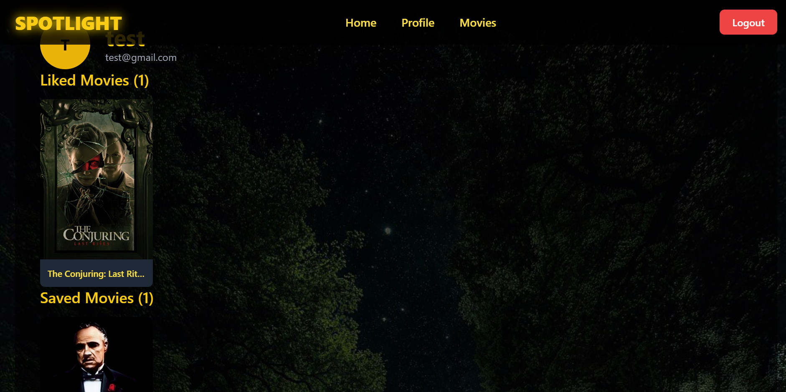

# 🎬 SPOTLIGHT

Spotlight is a full-stack web application that provides personalized movie recommendations. Users can browse movies, like their favorites, and receive tailored suggestions generated by a content-based recommendation engine built in Python.

## ✨ Features
User Authentication: Secure user registration and login using JWT.

Movie Browsing: Users can explore and search for movies fetched from the TMDB API.

Personalized Recommendations: An AI-powered backend service suggests movies based on the user's liked movies.

Like & Save Movies: Users can like movies to train the recommendation model and save movies to their profile.

Full-Stack Architecture: A complete MERN stack application communicating with a separate Python/Flask microservice for machine learning.

## 💻 Tech Stack
This project is built with a modern, microservice-based architecture.

Frontend: React, Vite, Tailwind CSS

Backend (Main API): Node.js, Express, MongoDB

Backend (ML Service): Python, Flask, Pandas, Scikit-learn

Authentication: JSON Web Tokens (JWT)

Deployment: Git & GitHub

## 🚀 Getting Started
To get a local copy up and running, follow these simple steps.

Prerequisites
Node.js & npm installed

Python & pip installed

MongoDB account (or local instance)

A free API key from The Movie Database (TMDB)

---

### 📸 Screenshots#

### Home Page

### Signup Page

### Login Page

### User Profile Page

### Movie Pages

### Search 

### Liked

### Liked and saved movies on User Profile Page

### Recommendation page

